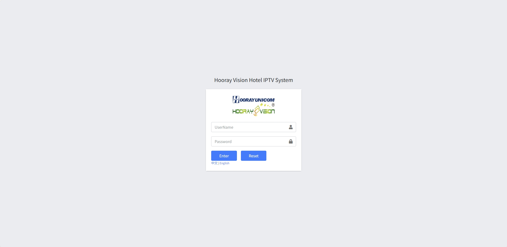

# Быстрый старт

Этот онлайн-документ описывает работу платформы Hooray Hotel IPTV и охватывает разделы:

1. Настройка клиентов  
2. Live и VOD  
3. Реклама  
4. Сервис отеля  
5. Кастомизация  
6. Информация о рейсах  
7. Погода  
8. Инфраструктура  
9. Права доступа  
10. Базовые системные настройки  

Руководство помогает администраторам настраивать эти разделы и понимать их возможности. Используя его, вы получите целостное представление о функциях и работе платформы, что позволит эффективнее управлять IPTV-сервисом.

## Подготовка

1. Подготовьте ноутбук или ПК с доступом к веб-интерфейсу IPTV.  
2. Откройте адрес: `http://{server ip}:{8080}`. При корректном доступе появится страница логина.

> :warning: Если страница недоступна, проверьте:  
> 1) Кабель сети подключён корректно.  
> 2) Ноутбук/ПК успешно пингует IP IPTV-сервера.
