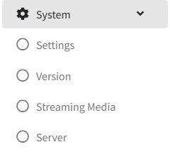

# System Setting

>Introduction

 

In `System`, the administrator can modify the IPTV system information, including the import of authorization information, the database being backed up, and the security settings of external API interface.

## Setting

>Introduction

 

In `Setting`, the administrator configures the basic information that needs to be synchronized to the terminal, the background image of each hierarchical page, Time Format and some other detailed parameters.

**Monetary Unit**: In the `Monetary Unit`, the administrator enters the local equivalent of the dollar sign, which is used to display the local dollar sign in Shopping.

**Paid Days**: In `Paid Days`, When the guest clicks to purchase a live package or an movie, it is the set expiration time.

**Consumption Mode**: In `Consumption Mode`, In Consumption Mode, the administrator selects the guest's payment method. In `Prepaid consumption`, when the guest consumes, they need to recharge the amount to the account first. Only when there is enough amount in the account can they consume. If the amount is insufficient, they cannot consume. In `Advance Consumption`, guests can consume without recharge, and the consumption is recorded in the room amount in the form of accounts receivable.

**Home Page Show**: In `Home Page Show`, the administrator selects the way the home page background is displayed in the drop-down list. When Image is selected, the uploaded background image is displayed. When Video is selected, the uploaded video file is displayed.

**Time Format**: In `Time Format`, the administrator manually sets the time format displayed on the front end.

**Favorite Operation**: In `Favorite Operation`, Administrators set whether to clear the favorite list saved by the guest when checking out.

**Request ring**: In `Request ring`, the administrator uploads the corresponding order alert tone. Currently deprecated due to browser technical factors.

**Welcome Background**: In `Welcome Background`, the administrator needs to upload the welcome background picture which will be synchronized to the TV side.

**Home Background**: In `Home Background`, the administrator needs to upload the home background picture which will be synchronized to the TV side.

**Secondary Menu Background**: In `Secondary Menu Background`, the administrator needs to upload the secondary menu background picture which will be synchronized to the TV side.

**LOGO**: In `LOGO`, the administrator needs to upload the logo picture which will be synchronized to the TV and mobile side.

**Live Player Watermark**: This feature is currently deprecated.

**Vod Player Watermark**: This feature is currently deprecated.

**City**: In `City`, the administrator inputs the corresponding city name, and the IPTV server will get the weather information and forward it to different terminals.

**Enable Remote Assistance**: This feature is currently deprecated.

## Version

>Introduction

 

In APK Version Management. Administrators can configure upgrade policies for different terminals, supporting both mandatory and non-mandatory upgrade methods.

Press `APK Upgrade` button will upload the apk, After clicking the APK upgrade button, an upload page will pop up. After selecting the APK file to be upgraded, the system will automatically process the file version information and display it in the upgrade list. The administrator needs to check if it is correct.
