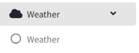
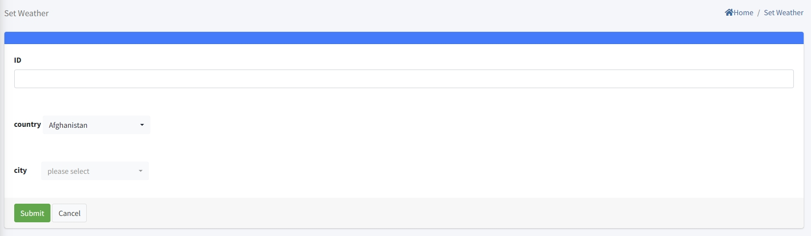

# Weather Setting

> Introduction

In `Weather Menu`, administrators can add, delete, and modify the names of destination cities. The IPTV system will automatically obtain the weather information for the next seven days of these cities through a third - party interface based on the city names, and then forward this information to terminal devices through interface messages. The terminal devices will display the information on a large screen.

Press `Add` button to create the new airport information

**ID**: The ID number is the identification number. The smaller the identification number, the higher its position in the list. It should be noted that the identification number must be unique.

**Country**: `Country` represents the country where the city is located.

**City**: Select the `city` from the dropdown menu. This city is the destination city for which you need to query the weather.

> Terminal Screen

