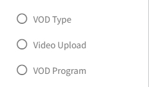
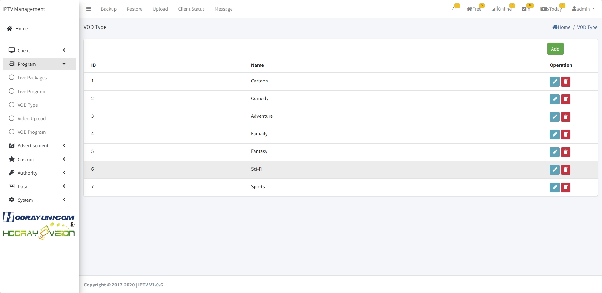
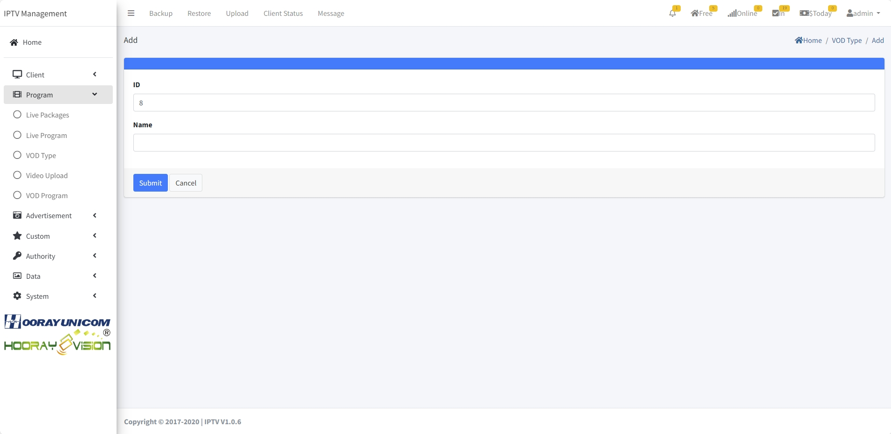
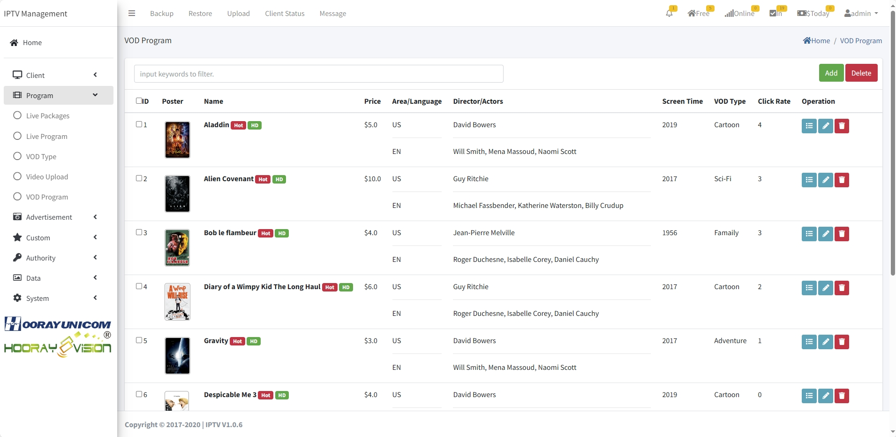
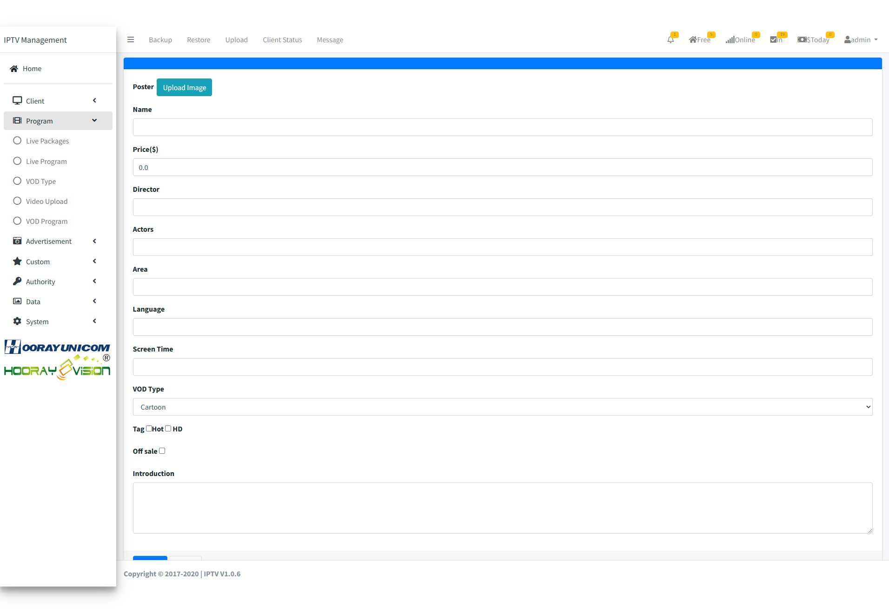
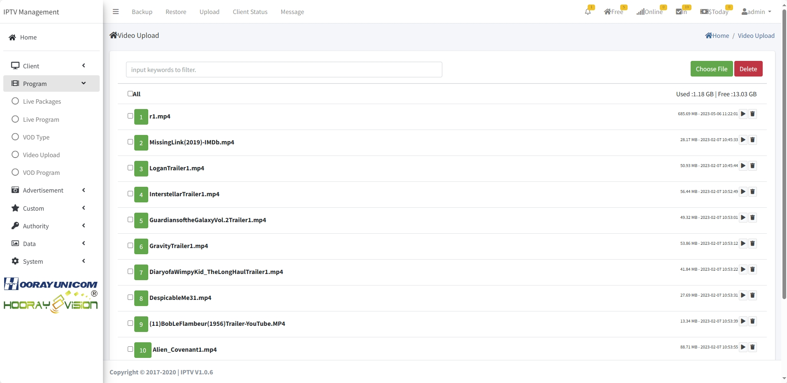
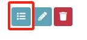
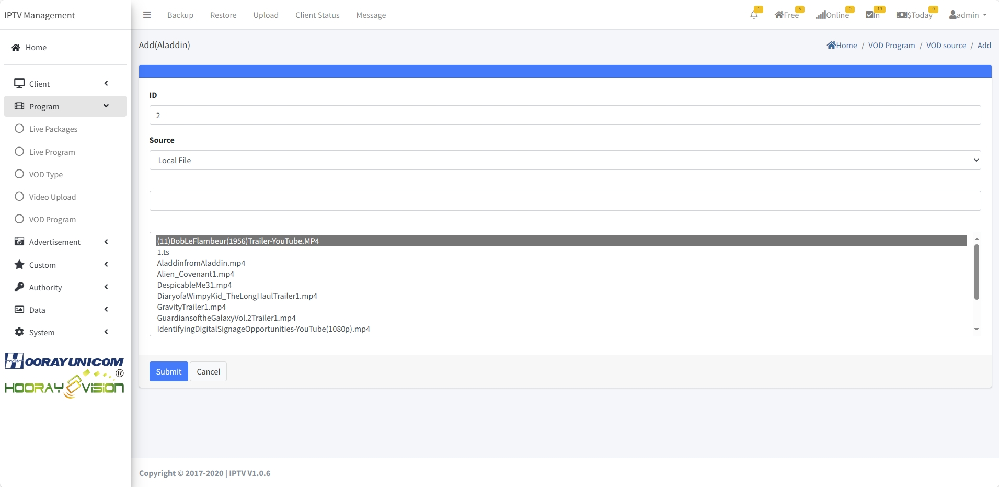

# Video On Demand Setting

>Introduction

The `Video On Demand` allows administrators to create, modify, and delete `VDO Category`, `VOD Program` and `VOD Upload` settings.

## VOD Category

>Introduction

In the `VOD Category` feature, administrators can create, modify, and delete categories for movies. By creating VOD categories, administrators can better organize and associate the corresponding movies with the respective categories. This allows subscribers to conveniently search and categorize the movies they want to watch.

Administrators can create new `VOD category` by clicking on the `Add` button. 

1. **ID**: This `ID` is automatically generated by the system and can be manually edited. When manually editing, it should not conflict with other ID. This `ID` is the VOD category sequence number, and the lower the ID number, the earlier the VOD category will be displayed on the set-top box for VOD menu.

2. **Name**: The `Name` is mainly used for displaying the VOD category name on the set-top box.

## VOD Program

>Introduction

Administrator can add, edit, delete movie information and bind movie files to corresponding movies in `VOD Program` menu. After adding movie information, administrator can view the new movie poster and corresponding information in the `VOD Program` menu, and the administrator can also view the number of times the new movie has been on demand.

Administrators can create new `movie` by clicking on the `Add` button. 

1. **Poster**: The administrator uploads the corresponding movie `Poster` through the page, and the `poster` will appear on the terminal to distinguish the movie information and attract subscribers to click on the corresponding movie to play.

2. **Name**: The `Name` is used for displaying the movie name on the set-top box.

3. **Price**: Administrator can set the `price` of movie charge, when the price is 0, it means the movie is free, if the price is not 0, the guest access to the movie will be prompted to charge.

4. **Director**: The `Director` is displayed in the movie details, and subscribers can view the corresponding information when they click the movie poster to enter the movie details.

5. **Actors**: The `Actors` is displayed in the movie details, and subscribers can view the corresponding information when they click the movie poster to enter the movie details.

6. **Area**: The `Area` displays the region of release in the movie details, and subscribers can view the corresponding information when they click the movie poster to enter the movie details.

7. **Language**: The `Language` displays the default audio language in the movie, and subscribers can view the corresponding information when they click the movie poster to enter the movie details.

8. **Screen Time**: This `Screen Time` is displayed in the movie details, and subscribers can view the corresponding information when they click the movie poster to enter the movie details.

9. **VOD Type**: The `VOD Type` selects the movie category to which the movie belongs, the movie category is used to partition the movie category so that the subscriber can quickly find the corresponding movie when searching for the corresponding category.

10. **Tag**: The `Tag` is used to indicate whether the movie belongs to Hot Movies or not, when it is indicated as a Hot Movie, the movie will appear in the Hot Category and be displayed at the top of the VOD page.

12. **Off Sale**: The `Off Sale` to setup the movie offline from app

12. **Introduction**: This `Introduction` Used to introduce movie details

## VOD Upload

>Introduction

In VOD Upload page, administrator can upload, delete movie files, movie file format must comply with Hooray VOD standard. Movie file video encoding format is `HEVC/H.254/AV1`, audio encoding is `AAC/MP3/AC-3/E-AC-3/FLAC/DTS`, upload movie file format MUST BE `.MP4`.

!> :warning: **Warning: Uploaded file names `MUST` be free of special symbols and spaces.**

Click `Choose File` will popup the upload windows, select the movie file to upload, When the file has been uploaded, the upload page automatically refreshes the uploaded file. and displayed in the upload list.

!> After uploading the movie file, click `VOD Program` to jump to the movie information list, select the corresponding movie information and click the icon to bind the movie with uploaded file.

Click the `Add` button to go to the Add page

1. **ID**: the `ID` is automatically generated by the IPTV system, the generated ID number is used for movie file display sorting, the smaller the number is, the file is displayed in the APP in the front.

2. **Source**: The `Source` drop down to select the movie file storage address `URL` or `Local File`, uploaded through the IPTV system to select `Local File`, through other ways of storage to select `URL`.

3. **URL**: When URL is selected in the `Source` section, then fill the URL in input box with the corresponding URL from the remote server.

